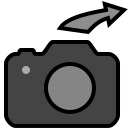
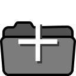

Establishing your library
=========================

Photohoard keeps metadata about your pictures (including timestamps,
exposure information, and camera details) as well as all your edits in
a database file. It does not touch your original image files
[#1]_. This database needs to be setup the first time you use the
program. We'll assume that you already have a set of shoeboxes full of
photos. Perhaps they are stored in various subfolders of
/home/me/Pictures as well as in /data/more/Photos.

The first time you run Photohoard, it will ask you to tell it about
these locations by way of this dialog:

  .. image:: firstrun.png
             :width: 682
             :align: center

If you are happy to have Photohoard index your “Pictures” folder, you
can simply click “OK,” otherwise the “Add” and “Remove” buttons are
your friends. It is perfectly fine to only add a single location at
this time, as you can easily add other locations later. You can even
start with a small subset of your collection now, e.g.,
“/home/me/Pictures/small/subset”, and add “/home/me/Pictures” later:
Photohard will understand that your original selection is now part of
the larger whole.

Once you click “OK,” Photohoard will immediately start indexing the
specified folder and its descendants. It will also start generating
preview images. Depending on your CPU speed, and even more so on the
speed of your storage media, this may take a while. Photohoard is much
zippier if your home folder is on an SSD than on a hard disk. Indexing
and preview generation occurs in the background, so you don't need to
wait for it. However, if you are trying to assess whether Photohoard
is responsive enough for your use case, it is recommended that you
postpone that assessment until indexing is complete. (A counter of
folders and photos being indexed is displayed at the bottom right of
the main window.)

Critical note
-------------

Photohoard does not copy or move your original image files. It simply
creates references to them in its database. Just to be clear: That
means that **you must not delete the original files**. (If you do
delete them, Photohoard will drop them from its database next time you
rescan the tree; more on this below.)

Adding more photos
===================

There are several ways to add more photos to Photohoard:

From a camera
---------------

If your photos are on a card from a digital camera, the easiest thing
to do is to insert that card in your computer, make sure it gets
mounted (which GNOME and Cinnamon do automatically), and click the
|import| icon (or press Control+I). A dialog window pops up in which
you can choose where the photos will be stored. (If Photohoard
complains that “No removable media can be found,” it usually suffices
to open the card in a Files window.)

                    

This same procedure also works for many cameras if you attach it to
your computer with a USB cable.

In the “Import” dialog, you can also specify that Photohoard should
delete the files from the card after importing, or move them to a
backup location. This location is a folder called “photohoard-backup”
in the root of your card. (This is my preferred method. I delete that
backup just prior to the next time I import photos, in the secure
knowledge that I have backed up my laptop since the time I previously
imported photos.)

Photohoard cannot handle movie files, but if there are any movie files
on your card, it does offer to move them over to your computer. (I
have to admit I still keep movie files in a digital cardboard box.)

From elsewhere
---------------

If your image files are already on your computer, e.g., in a
“Downloads” folder, you can simply drag them into Photohoard. A dialog
will appear that allows you to copy or move the files into one of the
previously incorporated trees.  Also, if you click the |import| icon
when no card is inserted, Photohoard will give you the option to
browse for files to import.

Alternatively, you can place the images inside a folder tree that
Photohoard already knows about. Photohoard will not automatically
discover that you did that, but you can tell it to check all of its
folder trees for new or modified files by clicking the |rescan| icon
(or pressing Control+R). This operation may take a while to complete,
but runs in the background so you don't have to wait for it.

Adding additional contents trees
----------------------------------

If your images are already on your computer and you don't want to move
them, you can click the |folderadd| icon (or press
Control+Shift+R). Adding a folder to Photohoard in this way
permanently includes it and its descendants in the database index.

Footnote
--------------------

.. [#1] Except during the :ref:`“Purge Rejects” <purge>` operation.
