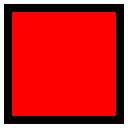
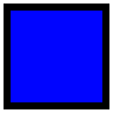
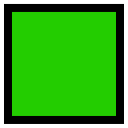
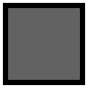
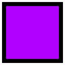
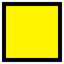

Tools to organize your pictures
===============================

Photohoard supports several methods to mark up your photos to aid
organization. These methods are:

- Status

  Each photo can be marked either “new,” “undecided,”
  “accepted,” or “rejected.” Photos are automatically marked
  “new” upon import, and “undecided” upon first view. Press
  Control+G to mark a photo as “accepted,” Control+X to mark a
  photo as “rejected,” or Control+U to mark a photo as
  “undecided.” Status is indicated by a small colored mark on the
  top right of the image tile.

- Color label

  Each photo can be marked with a color that is applied to the border
  of the image tile. Use Control+1 through Control+5 to apply a color
  label, Control+0 to remove it, or use the |red| |yellow| |green|
  |blue| |purple| and |gray| icons.
    
- Star rating

  Each photo can be marked with a rating of 1 through 5 stars by
  pressing Alt+1 through Alt+5. Use Alt+0 to remove the rating.  The
  star rating is indicated on the bottom left of the image tile.
    
- Tags

  Any number of arbitrary textual tags can be attached to photos, as
  explained :ref:`below <Tagging>`.

- Collections

  Collections :ref:`(below) <Collections>` are a special kind of tag
  intended for high-level organization.

  

  

  

  

  

Tagging
---------

To apply a tag to an image or selection of images, simply type a tag
name in the “New tag...” box near the bottom right of the
window. While typing, the name of your tag will appear in deep red if it is
truly new, in green if it is a unique abbreviation of an existing tag,
or in black if it is not unique. Press Enter to apply the tag. This is
only possible if what you typed is either truly new or a unique match to an
existing tag. In the latter case, the tag name will be automatically expanded.

Tags can be organized in a hierarchy as well. For instance, you might
have a tag “Places:Cities:Los Angeles.” If such a tag exists, you
could refer to it using abbreviations like “Los Ang,” “Cit:Los,”
“Pl:C:L,” or “Pla::Los,” assuming you don't have a
“Places:Cities:Los Alamos” tag.

The “New tag...” box is part of a larger “Tags” panel that
can be used to manage tags more broadly. Any tag that applies to all
images in the current selection are shown in black. Tags that apply to
only some images in the current selection are shown in blue. If you
hover over a tag, a small “--” icon appears that removes the tag
from all images in the selection. For blue tags, there will also be a
small “+” icon that applies the tag to all images in the selection.

  .. image:: tags.png
             :width: 313
             :align: center

The “Tags” panel also features a small “...” icon at the bottom
right. Click this to open the tag manager in which you can browse your
tag hierarchy, apply or remove tags from images, and create or delete
tags entirely. (Tags can only be deleted if they are not attached to
any images.)

Collections
---------------

I find it convenient to keep all of my photos in a single Photohoard
database. But you may have several very distinct bodies of
photographic work. For instance, I have family pictures and
work-related photos. Photohoard accommodates this situation by
allowing you to group images into “collections.” A collection is
nothing but a regular “tag” inside the “Collections” tag
group. Whenever you import photos into Photohoard, you are offered the
choice to associate them with a new or existing collection.

  .. image:: collection.png
             :width: 437px
             :align: center

New collections can also be created with the “Tag manager.” There is
nothing special about collections as opposed to other tags, except
that the “Filter” dialog has a special section for filtering based on
collection.
                     
